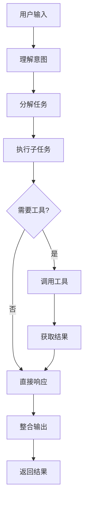

# AI Agent 入门指南

> [!info] 什么是 AI Agent
> AI Agent 是大型语言模型（LLM）结合记忆、工具和规划能力的自主执行系统。

## 核心组件

AI Agent 由四个核心组件构成：

1. **大型语言模型 (LLM)** - 核心推理引擎
2. **记忆系统 (Memory)** - 存储和检索信息
3. **工具调用 (Tools)** - 与外部世界交互
4. **规划能力 (Planning)** - 分解和执行任务

## 工作流程

## 相关概念

- [[LLM]] - 大型语言模型基础
- [[RAG]] - 检索增强生成
- [[向量数据库]] - 知识存储方案

## 延伸阅读

- [OpenAI Agent 文档](https://platform.openai.com/docs/guides/agents)
- [LangChain Agents](https://python.langchain.com/docs/concepts/agents/)
- [[知识库]] 中的 AI-Agent 相关笔记

## 实践项目

> [!todo] 实践清单
> - [ ] 搭建基础 Agent 框架
> - [ ] 实现工具调用功能
> - [ ] 添加记忆系统
> - [ ] 部署到生产环境

---

*本文档由 Obsidian-WuKongManager 自动生成*
